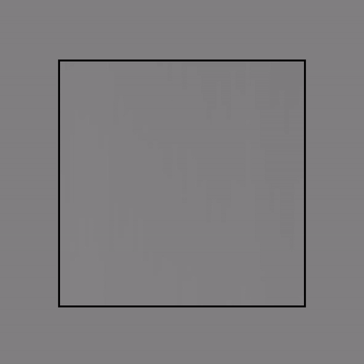

# Description
A 2 layer neural network class made without any external libraries. In this particular example, it is being used to solve XOR represented on a grid. 
It consists of 2 input nodes, 4 hidden nodes, 1 output node, and it uses the sigmoid activation function (with options for tanh and ReLU within the class).

https://noahprero.com/xor_nn

# Usage
The class includes 2 functions to use with the neural network:
```JavaScript
// Create a neural network with 2 inputs, 2 hidden, and 1 output
nn = new NeuralNetwork(2, 2, 1)  

// Adjusts the weights and biases based off of 
// the passed input array and desired result array
nn.train(inputs, desired_outputs)  

// Takes an input array and predicts the value with the
// current weights and biases of the network and returns the output
nn.predict(inputs)  
```


